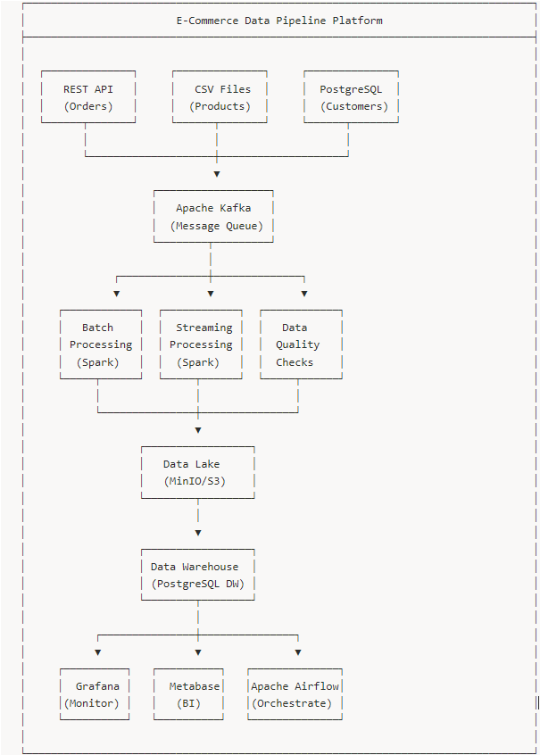

# E-Commerce Data Pipeline Platform

A production-ready, scalable data pipeline platform for e-commerce analytics, demonstrating modern data engineering practices with Apache Spark, Kafka, Airflow, and PostgreSQL.



## 🏗️ Architecture Overview
text
┌─────────────────────────────────────────────────────────────────────────────────┐
│                        E-Commerce Data Pipeline Platform                        │
├─────────────────────────────────────────────────────────────────────────────────┤
│                                                                                 │
│  ┌──────────────┐     ┌──────────────┐     ┌──────────────┐                     │
│  │   REST API   │     │   CSV Files  │     │  PostgreSQL  │                     │
│  │   (Orders)   │     │  (Products)  │     │  (Customers) │                     │
│  └──────┬───────┘     └──────┬───────┘     └──────┬───────┘                     │
│         │                    │                    │                             │
│         └────────────────────┼────────────────────┘                             │
│                              ▼                                                  │
│                    ┌──────────────────┐                                         │
│                    │   Apache Kafka   │                                         │
│                    │  (Message Queue) │                                         │
│                    └────────┬─────────┘                                         │
│                             │                                                   │
│              ┌──────────────┼──────────────┐                                    │
│              ▼              ▼              ▼                                    │
│     ┌────────────┐  ┌────────────┐  ┌────────────┐                              │
│     │   Batch    │  │  Streaming │  │   Data     │                              │
│     │ Processing │  │ Processing │  │  Quality   │                              │
│     │  (Spark)   │  │  (Spark)   │  │  Checks    │                              │
│     └─────┬──────┘  └─────┬──────┘  └─────┬──────┘                              │
│           │               │               │                                     │
│           └───────────────┼───────────────┘                                     │
│                           ▼                                                     │
│                  ┌─────────────────┐                                            │
│                  │   Data Lake     │                                            │
│                  │   (MinIO/S3)    │                                            │
│                  └────────┬────────┘                                            │
│                           │                                                     │
│                           ▼                                                     │
│                  ┌─────────────────┐                                            │
│                  │ Data Warehouse  │                                            │
│                  │ (PostgreSQL DW) │                                            │
│                  └────────┬────────┘                                            │
│                           │                                                     │
│           ┌───────────────┼───────────────┐                                     │
│           ▼               ▼               ▼                                     │
│     ┌──────────┐   ┌──────────┐   ┌──────────────┐                              │
│     │  Grafana │   │  Metabase│   │Apache Airflow│                              │
│     │(Monitor) │   │   (BI)   │   │(Orchestrate) │                              │
│     └──────────┘   └──────────┘   └──────────────┘                              │
│                                                                                 │
└─────────────────────────────────────────────────────────────────────────────────┘


## ✨ Features

### Data Ingestion
- **Multi-source ingestion**: REST APIs, CSV/JSON files, databases
- **Real-time streaming**: Apache Kafka integration
- **Incremental loading**: CDC (Change Data Capture) support
- **Schema validation**: Automatic schema detection and validation

### Data Processing
- **Batch Processing**: Apache Spark for large-scale data processing
- **Stream Processing**: Real-time data processing with Spark Streaming
- **Data Transformations**: Comprehensive ETL transformations
- **Data Enrichment**: Join and enrich data from multiple sources

### Data Quality
- **Automated Checks**: Completeness, accuracy, consistency, timeliness
- **Data Profiling**: Statistical analysis of data characteristics
- **Anomaly Detection**: Identify data quality issues automatically
- **Quality Reports**: Detailed quality metrics and dashboards

### Data Warehouse
- **Star Schema**: Optimized dimensional modeling
- **Slowly Changing Dimensions**: SCD Type 1 and Type 2 support
- **Data Marts**: Pre-aggregated analytics tables
- **Query Optimization**: Materialized views and indexes

### Orchestration & Monitoring
- **Apache Airflow**: DAG-based workflow orchestration
- **Grafana Dashboards**: Real-time pipeline monitoring
- **Alerting**: Automated alerts for pipeline failures
- **Logging**: Centralized logging and audit trails

## 🚀 Quick Start

### Prerequisites

- Docker Desktop (4.0+)
- Docker Compose (2.0+)
- 16GB RAM (recommended)
- 50GB free disk space

### Installation

1. **Clone the repository**
```bash
git clone https://github.com/Danielfenghk/ecommerce-data-pipeline.git
cd ecommerce-data-pipeline

2. Start the pipeline
Bash

./scripts/start_pipeline.sh
3. Access the services
Airflow UI: http://localhost:8081 (admin/admin)
Spark Master: http://localhost:8080
Grafana: http://localhost:3000 (admin/admin)
Metabase: http://localhost:3001
MinIO: http://localhost:9001 (minioadmin/minioadmin123)
Running Tests
Bash

./scripts/run_tests.sh